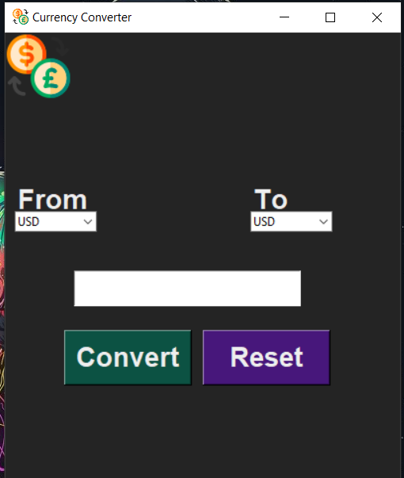

# Currency Converter

This is a simple currency converter program written in Python using the tkinter and forex_python modules.

## Installation
1. Clone the repository to your local machine or download the zip file.

2. Install the required modules using pip:

```Bash
pip install tkinter forex-python
```

## Usage
1. Open the program in your Python IDE.
2. Run the program.
3. Select the "From" and "To" currencies from the drop-down menus.
4. Enter the amount you want to convert in the entry widget.
5. Click the "Convert" button to convert the amount to the selected currency.
6. Click the "Reset" button to clear the amount and converted amount.
7. Close the program window.


### App look like this:


